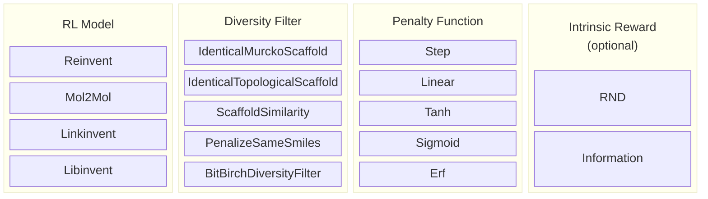

# Diversity Filter

The diversity filter penalises molecules that have high similarity with previously seen molecules, encouraging the RL agent to explore chemical space rather than collapsing onto a narrow set of high-scoring scaffolds.

## Components



The penalty function and (optionally) an intrinsic reward are always attached to the filter.

## Configuration (`[diversity_filter]`)

| Parameter            | Default | Description                                                                 |
|----------------------|---------|-----------------------------------------------------------------------------|
| `type`               | —       | Filter class name (see table below)                                         |
| `bucket_size`        | 25      | Max molecules per cluster before penalty kicks in                           |
| `minscore`           | 0.5     | Minimum score for a molecule to be memorised                                |
| `penalty_function`   | `Step`  | How score is scaled based on bucket utilization: `Step`, `Linear`, `Tanh`, `Sigmoid`, `Erf` |
| `intrinsic_reward`   | —       | Optional exploration bonus: `RND` or `Information`                          |
| `learning_rate`      | 1e-4    | Optimizer rate for `RND` intrinsic reward                                   |

## Filter Types

| `type`                           | Clusters by                          | Extra parameters                                      |
|----------------------------------|--------------------------------------|-------------------------------------------------------|
| `IdenticalMurckoScaffold`        | Murcko scaffold (SMILES)             | —                                                     |
| `IdenticalTopologicalScaffold`   | Topological scaffold (SMILES)        | —                                                     |
| `ScaffoldSimilarity`             | Scaffold Tanimoto similarity         | `minsimilarity` (default 0.4)                         |
| `PenalizeSameSmiles`             | Exact SMILES match                   | `penalty_multiplier` (default 0.5)                    |
| `BitBirchDiversityFilter`        | BitBIRCH fingerprint tree            | `merge_threshold`, `branching_factor`, `discard`, `recluster_interval`, `recluster_tolerance` |                              |

## Example (TOML)

```toml
[diversity_filter]
type            = "BitBirchDiversityFilter"
bucket_size     = 25
minscore        = 0.5
penalty_function = "Tanh"
merge_threshold  = 0.65
branching_factor = 2500
intrinsic_reward = "RND"
learning_rate    = 1e-4
```

## Notes

- **Step** penalty immediately zeros the score once a bucket is full — most aggressive exploration pressure.
- **Tanh / Sigmoid / Erf** give a smooth ramp, allowing the agent to still occasionally revisit populated clusters.
- **Intrinsic reward** adds a bonus proportional to how much new information a molecule brings, independent of the extrinsic scoring function. Useful when the oracle is sparse.
But this also allows the score to go beyond 1. Set `termination = "Null"`in `[[stage]]` to avoid early stopping.  
