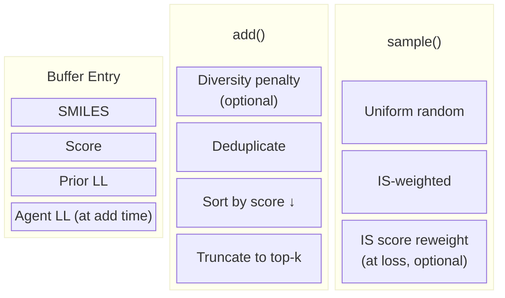
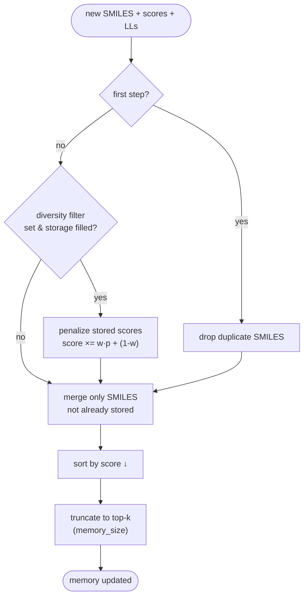
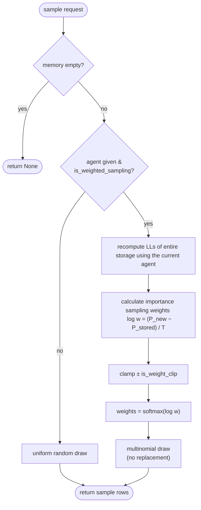

# Inception Replay Memory

Inception keeps a small buffer of high-scoring SMILES and replays them into the RL loss each step, guiding the agent toward promising regions of chemical space and speeding up optimization. The buffer is score-ordered and capped at `memory_size`, so the original seed molecules are quickly replaced by better ones the agent discovers.

## Components



Each buffer entry is a 4-tuple `(SMILES, score, prior_ll, agent_ll)`. The stored agent log-likelihood is a snapshot taken when the molecule entered the buffer; it is the reference used for importance-sampling (IS) correction.

## The two phases (per RL step)

### 1. add() — how SMILES enter memory



### 2. Sample — how SMILES leave memory



## Configuration (`[inception]`)

| Parameter                 | Default | Description                                                                                     |
|---------------------------|---------|-------------------------------------------------------------------------------------------------|
| `memory_size`             | 50      | Max SMILES kept in the buffer (top-k by score)                                                   |
| `sample_size`             | 10      | SMILES replayed from the buffer into the loss each step                                          |
| `smiles_file`             | —       | Optional seed SMILES file; if omitted the buffer is populated from the first sampled batch       |
| `diversity_penalty_weight`| 0.0     | Blend of diversity penalty applied when re-scoring stored SMILES, in `[0, 1]` (0 = off, 1 = full) Diversity Penalty needs to be configured and active |
| `is_weighted_sampling`    | false   | Draw from the buffer with IS weights instead of uniformly                                        |
| `is_weighted_scores`      | false   | Reweight replayed scores by IS weights at loss time (mean-preserving)                            |
| `is_weight_clip`          | —       | Clamp log IS weights to `[-clip, clip]` before softmax (None = disabled)                         |
| `is_weight_temperature`   | 1.0     | Temperature divisor `T` applied to log IS weights                                                |
| `debug`                   | false   | Record per-step buffer/IS metrics into tensorboard results and logs                                        |

## Background for Importance sampling

When the current policy has drifted from the snapshot stored at add time, older buffer entries no longer reflect the agent's distribution. Using inception is inheritly off-policy. 
Importance sampling tries to correct for this by reevaluating the sample under the current agent and weigh the sampling from the inception buffer accordingly:

$$w_i = \frac{P_\text{current}(x_i)}{P_\text{stored}(x_i)} = \exp\!\Big(\frac{\log P_\text{current}(x_i) - \log P_\text{stored}(x_i)}{T}\Big)$$

Weights are optionally clamped and passed through a softmax for a numerically stable, normalized distribution.
The entire calculating is just based on the negative log likelihoods, the actual probablities are not known and would lead to numerical instability.

- **`is_weighted_sampling`** uses these weights to *select* which buffer entries to replay (upweighting molecules the current policy now favors).
- **`is_weighted_scores`** uses these weights to *rescale* the replayed scores in the loss (`score × w × N`, mean-preserving), applied in the reward/loss step after sampling. This is much more efficient, as just the sampled entries have to be reevaluated against the current agent. But mathematically this diverges from importance sampling a lot.

The two are independent and can be enabled together.
Results usually show that just **`is_weighted_sampling`** on its own is the most promising.


## Diversity penalty coupling

If a `DiversityFilter` is attached and `diversity_penalty_weight > 0`, stored scores are penalized on each add before re-sorting, so over-represented scaffolds are demoted out of the buffer over time:

$$\text{penalty}_i = w \cdot p_i + (1 - w)$$

$$\text{score}_i \leftarrow \text{score}_i \cdot \text{penalty}_i$$

where $w$ is `diversity_penalty_weight` and $p_i$ is the raw penalty from the diversity filter.

With weight `0.0` the penalty is a no-op; with `1.0` the filter's raw penalty `p` is applied in full. See [diversity_filter.md](diversity_filter.md) for the filter and penalty-function options.

## Example (TOML)

```toml
[inception]
memory_size             = 128
sample_size             = 64
smiles_file             = "seeds.smi"
diversity_penalty_weight = 0.5
is_weighted_sampling    = true
is_weighted_scores      = true
is_weight_clip          = 5.0
is_weight_temperature   = 1.0
debug                   = true
```

## Notes

- Seed SMILES are loaded once via `update()` before training begins; their agent LL is initialized to the prior LL as a proxy (no policy snapshot exists yet).
- Deduplication against duplicates within the batch only runs on the first step; afterward new entries are just filtered against SMILES already in the buffer.
- Buffer entries are only ever replaced by *higher-scoring* molecules, so the buffer monotonically improves in score (subject to any diversity penalty which could lower the score over time).
- With IS disabled the buffer behaves as the classic Reinvent inception memory: uniform replay of the top-k scorers.
