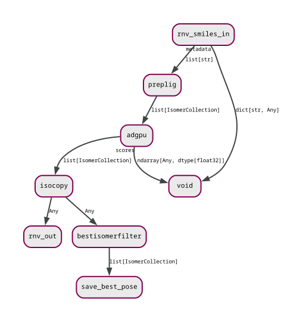

# REINVENT4 tutorial with Maize

This tutorial provides an overview on how to use the [Maize](https://github.com/MolecularAI/maize) workflow manager with REINVENT4.  All example runs use [AutoDock GPU](https://github.com/ccsb-scripps/AutoDock-GPU).  The tutorial is inspired by the results from the [disco crossdock benchmark](http://disco.csb.pitt.edu/Targets_top5.php).  Phospholipase A2 was chosen as a small and easy docking target using PDB IDs 1DB5 (isoform IIa) and 6G5J (isoform X).

## Preliminaries

- Install [maize-contrib](https://github.com/MolecularAI/maize-contrib) which also installs the Maize workflow manager.
- Install [AutoDock GPU](https://github.com/ccsb-scripps/AutoDock-GPU).
- Install [Gypsum-DL](https://github.com/durrantlab/gypsum_dl).
- Adjust the paths in `maize_global_config.toml`.

## Tutorials

The Maize workflow manager needs a global configuration file which maps executables and scripts.  It also allows setting up environent variables and slurm (neither used in this tutorial).  The actual workflow is defined in a YAML file.  The workflow is largely controlled through parameters in the REINVENT TOML file.

All tutorial runs use an intricate scoring setup which combines rule-of-5/Veber rules and group counts with docking.  Protein structures have been prepared with Schrodinger Maestro (the [HiQBind Dataset](https://figshare.com/articles/dataset/BioLiP2-Opt_Dataset/27430305) may be a viable alternative).  A script `prep.sh` outlines how to convert the input PDB and SDF to the required formats for AutoDock GPU.

### Visualisation and Analysis

Two notebooks, `WFViz.py` and `Analyze.py`, are provided for workflow visualisation and basic analysis.  Both need to be converted to notebook format before use e.g. `jupytext -o Analyze.ipynb Analyze.py`.

### AutoDock GPU workflow

REINVENT passes the SMILES sampled in the current RL step to the workflow for ligand preparation with Gypsum-DL.  In case Gypsum-DL fails (can be as high as 5-10% of cases), RDKit takes over and adds hydrogens by simple valence checks.  The 3D structures are then passed to AutoDock GPU which returns the docking score to REINVENT for each of the original SMILES.  A separate branch of the workflow extracts and stores the best poses from docking.  See the workflow in the figure below.

## Classical Reinvent prior

Three runs with results (CSV, poses) are provided using the _de novo_ Reinvent prior.

### 1DB5

Runs REINVENT with docking to 1DB5 to demonstrate use of Maize with REINVENT.  Some worked-out results are provided and can be explored with the notebook.

### 6G5J

Runs REINVENT with docking to 6G5J.  Results are provided and left as analysis exercise to the user.

### 6G5J vs 1DB5

Demonstration on how off-target docking could work.  The run is ultimately able to find molecules binding more preferentially to isoform X than to isoform IIa (as predicted per docking score).  This shows that the setup works, at least at the technical level.  Molecule structures would still need to be checked for suitability and in connection with the non-docking scores.

## Libinvent

### 6G5J vs 8ZYP

Another demonstration of off-target docking, in this case with hERG (PDB ID 8ZYP).  The structures are constraint by the indole-2-carboxamide scaffold from 6G5J.  The run is quite well able to find differential ligands but, again, check results for sanity.
