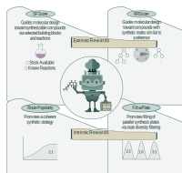

# SynthSense: Synthesis-aware REINVENT Rewards



**SynthSense** is a scoring component for [REINVENT4](https://github.com/MolecularAI/REINVENT4) that evaluates molecules based on their synthetic feasibility and route coherence using retrosynthetic analysis from [AiZynthFinder](https://github.com/MolecularAI/aizynthfinder).

For details please check the [preprint](https://doi.org/10.26434/chemrxiv-2025-jdcsr).

## Features

SynthSense provides multiple rewards to guide molecular generation:

- **SFScore**: Synthetic feasibility score combining stock availability, reaction preference and route complexity
- **RRScore**: Reference route similarity score using Tree Edit Distance (TED)
- **Route Popularity**: Promotes coherent synthetic routes within batches
- **Fill-a-Plate**: Promotes coherent synthetic routes across batches (route diversity filter)

## Prerequisites

SynthSense requires the following software:

1. **[REINVENT4](https://github.com/MolecularAI/REINVENT4)** - Molecular generation framework
   - **Important**: Required version 4.7 or newer, with scoring cache disable option (required for SynthSense)
2. **[AiZynthFinder](https://github.com/MolecularAI/aizynthfinder)** - Retrosynthetic planning tool
3. **[NameRxn](https://www.nextmovesoftware.com/namerxn.html)** (NextMove Software) - Reaction classification tool
   - **Commercial software** - purchase required from NextMove Software
   - Required for annotating reaction classes in AiZynthFinder
   - See [NAMERXN_SETUP.md](NAMERXN_SETUP.md) for detailed setup instructions

> **Note**: NameRxn is critical for SynthSense functionality as it provides reaction class annotations.

## Installation

### 1. Install Prerequisites

Ensure REINVENT4 (with scoring cache disable support) and AiZynthFinder are installed and working in your environment.

> **Critical**: SynthSense sets `no_cache = True` to disable scoring cache, which is essential for proper functionality. Ensure your REINVENT4 installation supports this feature.

### 2. Set up NameRxn

Follow the instructions in `NAMERXN_SETUP.md` to configure NameRxn for annotating AiZynthFinder retrosynthetic trees.

### 3. Install SynthSense

Copy `synthsense` directory into your REINVENT4 plugins directory:

```bash
# Assuming REINVENT4 is installed
cp -r synthsense /path/to/REINVENT4/reinvent_plugins/components/
```

## Usage Instructions

1. Copy these configuration files into your project directory and update them with absolute paths for your system:  
   - `examples/local_submitter.sh`  
   - `examples/run.sh`  
   - `examples/staged_learning`  
   - `config/config_synthsense.yml`  
   - `config/stocks_and_reactions_profiles.json`

2. Set your reaction and stock preferences in **`config_synthsense.yml`**.

3. Submit the job:  
   ```bash
   sbatch examples/run.sh

**Note: the number of CPUs allocated in run.sh equals the nproc value defined in examples/local_submitter.sh.**

## Examples

See the `examples/` directory for:
- `staged_learning.toml`: Complete REINVENT staged learning configuration (all rewards inside)
- `run.sh`: SLURM job submission script
- `reference_route_312_2110.json`: Example reference route

## Utilities

### Generate Reference Routes

Use `examples/generate_route.py` to create reference route JSON files (with NameRxn classes) that can be used with RRScore:

```bash
python generate_route.py -r 3.1.2 2.1.10 -o 312_2110_two_step_route.json
```

## Citation

If you use SynthSense in your research, please cite:

- Dekleva, D.; Voronov, A.; Janet, J. P.; Ekborg, A.; Borišek, J.; Rambaher, M. H.; Loeffler, H. H. Synthesizability via Reward Engineering: Expanding Generative Molecular Design into Synthetic Space, ChemRxiv, 2025.

- Loeffler, H. H.; He, J.; Tibo, A.; Janet, J. P.; Voronov, A.; Mervin, L. H.; Engkvist, O.
REINVENT 4: Modern AI–Driven Generative Molecule Design. J. Cheminf. 2024, 16 (1), 20.

- Genheden, S.; Thakkar, A.; Chadimová, V.; Reymond, J.-L.; Engkvist, O.; Bjerrum, E.
AiZynthFinder: A Fast, Robust and Flexible Open-Source Software for Retrosynthetic Planning. J. Cheminf. 2020, 12, 70.

- NextMove Software.
NameRxn (Expert System for Named Reaction Identification and Classification). 2022.
